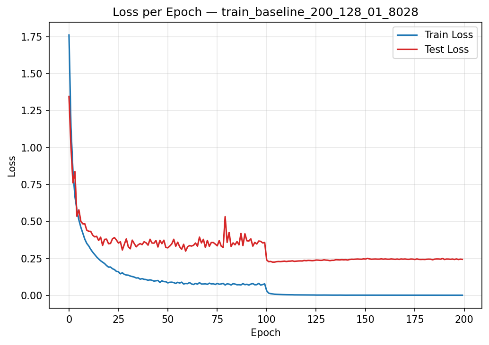
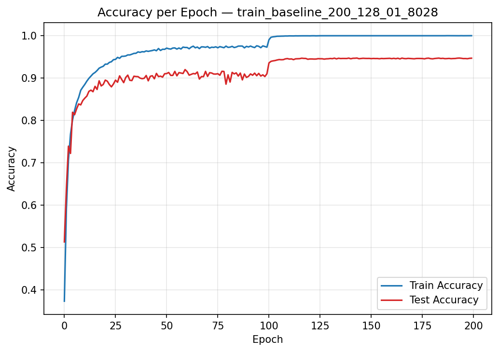
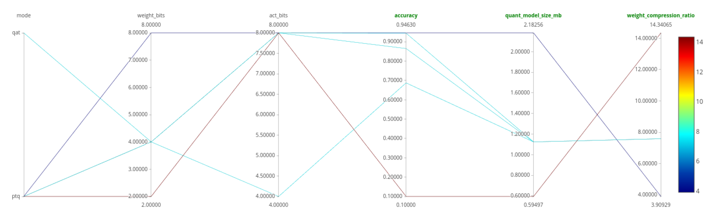

# CS6886:  Systems Engineering for Deep Learning | Assignment 2

## Model Compression for MobileNet-v2 on CIFAR-10

Trained a MobileNet-v2 from scratch on CIFAR-10, then compressed it using a custom quantization implementation (no `torch.ao`, `torch.quantization`). Supports Post-Training Quantization (PTQ) at configurable bit-widths and Quantization-Aware Training (QAT) with Straight-Through Estimator (STE).

**Results:** **94.46% Top-1 Accuracy at 1.45 MB on disk** (QAT W4/A8), down from 94.71% FP32 (8.53 MB), achieving **7.59× weight compression** with only a **0.25 pt accuracy drop**.

| Metric | Value |
|---|---|
| FP32 Baseline Accuracy | **94.71%** top-1 |
| FP32 Model Size | 8.53 MB (2,236,682 parameters) |
| Best Compressed Accuracy | **94.46%** (QAT, W4/A8) |
| Best Weight Compression Ratio | **7.59×** |
| Activation Compression Ratio | **4.00×** (A8) |
| Quantized Model on Disk | **1.45 MB** |

---

## 1. Requirements

| | |
|---|---|
| Python | 3.11 |
| GPU | Any CUDA GPU with ≥ 8 GB, used NVIDIA A100) |
| Disk | ~1 GB (CIFAR-10 ≈ 163 MB + checkpoints) |

Dependencies are listed in [`requirements.txt`](requirements.txt):
`torch`, `torchvision`, `numpy`, `matplotlib`, `mlflow`, `tqdm`.

## 2. Setup

```bash
git clone https://github.com/chatterjeesaurabh/Model-Compression-for-MobileNet-v2-on-CIFAR-10.git
cd Model-Compression-for-MobileNet-v2-on-CIFAR-10

# Create environment
conda create -n cs6886a2 python=3.11 -y
conda activate cs6886a2
# or: python3 -m venv .venv && source .venv/bin/activate

pip install -r requirements.txt
python -c "import torch; print(torch.__version__, torch.cuda.is_available())"
```

**Data:** CIFAR-10, downloads automatically into `./data/` by `torchvision.datasets.CIFAR10` the first time any script runs.

## 3. Repository Layout

```
├── src/                              # Core modules
│   ├── __init__.py
│   ├── mobilenetv2.py                # MobileNet-v2 architecture (CIFAR-10 adapted)
│   ├── quantize.py                   # Custom quantization: PTQ, QAT, STE, bit-packing
│   └── utils.py                      # Data loaders, training, evaluation, MLflow setup
│
├── main/                             # Entry-point scripts
│   ├── __init__.py
│   ├── train.py                      # Baseline & QAT training
│   ├── test.py                       # PTQ / QAT evaluation + compression summary
│   └── sensitivity.py                # Per-layer sensitivity analysis
│
├── data/                             # CIFAR-10 (auto-downloaded, git-ignored)
│   └── cifar-10-batches-py/
│
├── docs/                             # Figures & documentation
│   ├── loss.png                      # Training loss curves
│   ├── accuracy.png                  # Training accuracy curves
│   └── PTQ_QAT_Mlflow_Chart.PNG      # MLflow parallel coordinates chart
│
├── requirements.txt
├── .gitignore
└── README.md
```

## 4. Reproducing the Results

All commands should be run from the repository root. Every script supports `--help` for the full flag list.

### Step 1: Train the FP32 Baseline

```bash
python -m main.train --epochs 200 --lr 0.1 --batch_size 128 --model_dir models --num_classes 10
```

### Step 2: Post-Training Quantization (PTQ)

```bash
# W8/A8
python -m main.test --ptq --weight_bits 8 --act_bits 8 --model_dir models

# W4/A8
python -m main.test --ptq --weight_bits 4 --act_bits 8 --model_dir models

# W4/A4
python -m main.test --ptq --weight_bits 4 --act_bits 4 --model_dir models

# W2/A8
python -m main.test --ptq --weight_bits 2 --act_bits 8 --model_dir models
```

### Step 3: Quantization-Aware Training (QAT)

```bash
# Train QAT (starts from the baseline checkpoint)
python -m main.train --epochs 30 --lr 0.01 --batch_size 128 --model_dir models --num_classes 10 --qat --weight_bits 4 --act_bits 8

# Evaluate the QAT model
python -m main.test --qat --weight_bits 4 --act_bits 8 --model_dir models
```

### Step 4: Per-Layer Sensitivity Analysis

```bash
python -m main.sensitivity --model_dir models --bit_widths 2 4 8 --no_mlflow
```


---

## 5. Details

### Q1  Training Baseline

**Data** (`src/utils.py`):
- CIFAR-10: 50k train / 10k test images, 10 classes, 32×32 RGB.
- Normalisation: channel-wise mean `(0.4914, 0.4822, 0.4465)`, std `(0.2023, 0.1994, 0.2010)`.
- Training augmentation: `RandomCrop(32, padding=4)` + `RandomHorizontalFlip(0.5)`.
- Test & calibration: normalisation only (no augmentation) for deterministic evaluation.

**Architecture** (`src/mobilenetv2.py`):
- MobileNet-v2 modified for CIFAR-10, since its image size is 32×32 compared to ImageNet's 224×224 which MobileNet-v2 was originally designed for.
- Initial stem convolution stride reduced from 2 to 1; the first two expansion stages (c=24, c=32) also changed from stride 2 to stride 1, reducing total downsampling from 32× to 4×.
- Uses inverted residual blocks (expansion factor 1 for the first stage, 6 for all subsequent stages) with depthwise separable convolutions, following the original MobileNet-v2 design.
- ReLU6 activations, BatchNorm after every convolution, 0.2 dropout before the classifier.
- Kaiming normal weight initialisation. **2,236,682 parameters**.
- Trained from scratch (no ImageNet pretraining).

**Training** (`main/train.py`):

| Setting | Value |
|---|---|
| Optimizer | SGD, momentum 0.9, weight decay 4×10⁻⁵ |
| LR schedule | MultiStepLR: initial LR 0.1, ×0.1 at epochs 100 and 150 |
| Batch size | 128 |
| Epochs | 200 |
| Loss | CrossEntropyLoss |
| Seed | 1000 |

**Results:** Best test accuracy of **94.71%** at epoch 143, trained on a single NVIDIA A100 GPU.

<p align="center">
  
  
</p>

The loss and accuracy curves show rapid convergence in the first 10 epochs, followed by steady improvement. The MultiStepLR drops at epochs 100 and 150 produce clear jumps in test accuracy. A mild train-test gap (~5.3 pt) is expected given the light augmentation and model capacity.

---

### Q2  Custom Quantization Implementation

**Method** (`src/quantize.py`): Manual uniform quantization written entirely from scratch.

| Design Choice | Selection |
|---|---|
| Weight quantization | Symmetric, signed, zero-point = 0 |
| Activation quantization | Asymmetric, unsigned (post-ReLU range [0, 2ᵇ−1]) |
| Granularity | Per-tensor (weights and activations) |
| Calibration | Static min-max over 4096 training images (32 batches × 128) |
| Weight storage | Actual integer packing on disk — weights are quantized, bit-packed via `pack_intN()`, and saved. At evaluation, the packed model is loaded from disk and dequantized per-layer before MAC. Not fake quantization. |
| Sub-byte packing | `ceil(N·b/8)` bytes — two 4-bit values per byte, four 2-bit values per byte |
| QAT gradient | Straight-Through Estimator (STE) |

- **Layers quantized (53 total):** stem Conv2d, 16 pointwise expansion (1×1), 17 depthwise (3×3), 17 pointwise-linear projection (1×1), final 1×1 Conv2d, classifier Linear.
- **Exceptions kept in FP32:** BatchNorm (affine + running stats), biases, final logits, residual additions, ReLU6, pooling.
- **Storage overhead:** Per-tensor quantization yields only **0.69 KB** of metadata (53 weight scales + 53 activation scales, each 8 bytes).

---

### Q3  Compression Results

| Run | Mode | W bits | A bits | Accuracy | Wt. Size (MB) | Wt. Ratio | Act. Ratio | Disk (MB) |
|---|---|---|---|---|---|---|---|---|
| Baseline | FP32 | 32 | 32 | 94.71% | 8.53 | 1.00× | 1.00× | — |
| Run 1 | PTQ | 8 | 8 | 94.63% | 2.18 | 3.91× | 4.00× | 2.50 |
| Run 2 | PTQ | 4 | 8 | 86.52% | 1.12 | 7.59× | 4.00× | 1.45 |
| Run 3 | PTQ | 4 | 4 | 68.75% | 1.12 | 7.59× | 8.00× | 1.45 |
| Run 4 | PTQ | 2 | 8 | 10.00% | 0.59 | 14.34× | 4.00× | 0.92 |
| **Run 5** | **QAT** | **4** | **8** | **94.46%** | **1.12** | **7.59×** | **4.00×** | **1.45** |

**Key findings:**
- **W8/A8 PTQ** is nearly lossless (−0.08 pt).
- **W4/A8 PTQ** drops 8.19 pt - per-tensor scale cannot resolve 4-bit weight distributions.
- **W4/A4 PTQ** degrades further to 68.75% - 4-bit activations fail under min-max calibration for MobileNet-v2's diverse per-channel activation ranges.
- **W2/A8 PTQ** collapses to random chance (10.00%).
- **QAT W4/A8 recovers 7.94 pt** over PTQ at the same bits, reaching **94.46%** - only 0.25 pt below FP32. The STE enables the model to learn quantization-friendly weight distributions during fine-tuning.

<p align="center">
  
</p>
<p align="center"><em>MLflow parallel coordinates chart: PTQ vs QAT across all bit-width configurations. Colour encodes weight compression ratio.</em></p>

---

### Q4  Compression Analysis

**Reported configuration: QAT W4/A8** - the Pareto-optimal point balancing accuracy and compression.

| Metric | Value |
|---|---|
| Weight compression ratio | **7.59×** (8.53 MB → 1.12 MB) |
| Activation compression ratio | **4.00×** (29.72 MB → 7.43 MB per image) |
| Accuracy | **94.46%** (−0.25 pt from 94.71% FP32) |
| Model on disk | **1.45 MB** (from 8.53 MB) |
| Quantization overhead | 0.69 KB |

**Why this configuration:** QAT W4/A8 achieves 1.94× more compression than PTQ W8/A8 while losing only 0.17 additional accuracy points. It recovers 7.94 pt over PTQ at the same bit-width. More aggressive settings (W4/A4, W2/A8) fail catastrophically, confirming W4/A8 as the most aggressive viable configuration with per-tensor min-max quantization.

---

## 6. MLflow Tracking

All experiments are logged to MLflow (experiment: `cs6886_mobilenetv2_quantization`). Metrics tracked include per-epoch train/test loss and accuracy, quantized model sizes, compression ratios, and per-layer sensitivity scores.

```bash
mlflow ui --backend-store-uri mlruns
```

---

## Author

**Saurabh Chatterjee** · NS26Z334  
CS6886 Systems Engineering for Deep Learning  
Indian Institute of Technology Madras
